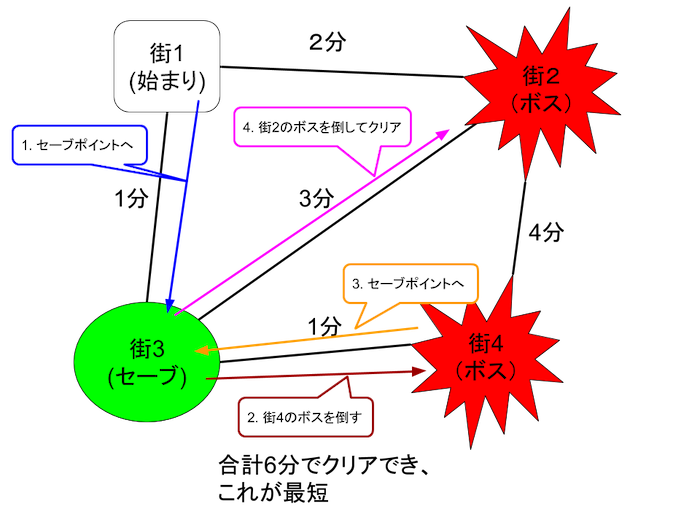

Here's the formatted README text for the "Paiza-Hero" RPG challenge suitable for a GitHub repository:

---

# Paiza-Hero RPG Challenge

## Description

In the RPG "Paiza-Hero," you play as a hero traveling through the country of Paiza. The country has `N` towns, each numbered from 1 to `N`. Some towns have save points, while others have bosses. The game begins in town 1, and the objective is to defeat all the bosses in the country. To complete the game, you must always stop at a save point before fighting each boss. We are interested in finding the shortest time required to clear the game, ignoring the time taken to defeat the bosses.




## Input Format

The input consists of the following:

1. **First Line:**
   - Four integers separated by spaces: `N` (number of towns), `M` (number of roads), `B` (number of bosses), `S` (number of save points).

2. **Second Line:**
   - `B` integers separated by spaces: The town numbers where the bosses are located.

3. **Third Line:**
   - `S` integers separated by spaces: The town numbers where the save points are located.

4. **Following `M` Lines:**
   - Each line contains three integers separated by spaces: `u_i` and `v_i` (town numbers connected by the road), and `t_i` (time to pass through the road).

   The total input will be `1 + 1 + 1 + M` lines, with a line break at the end of the last line.

   The last line of the input will have a newline at the end. The string will be passed from standard input.

## Expected Output

Output the shortest time required to defeat all the bosses. Ensure that the output:

- Is a single line with the shortest time.
- Includes a line break at the end.
- Contains no unnecessary characters or blank lines.

## Constraints

- `3 ≤ N ≤ 100`
- `1 ≤ M ≤ N * (N - 1) / 2`
- `1 ≤ B ≤ 16`
- `1 ≤ S ≤ N - B`
- `2 ≤ b_i ≤ N` (Boss towns, `1 ≤ i ≤ B`)
  - All `b_i` are distinct.
- `2 ≤ s_i ≤ N` (Save points, `1 ≤ i ≤ S`)
  - All `s_i` are distinct.
  - No `s_i` is equal to any `b_i`.
- `1 ≤ u_i, v_i ≤ N` (Roads, `1 ≤ i ≤ M`)
  - All `u_i` and `v_i` are distinct.
  - All towns are reachable from each other.
  - At most one road between any two towns.
- `1 ≤ t_i ≤ 10` (Travel time for each road)

## Input Example

```
6 8 2 2
2 6
4 3
2 4 1
4 5 4
2 3 5
1 4 10
4 6 1
2 5 2
1 2 8
5 6 1
```

## Output Example

```
12
```
